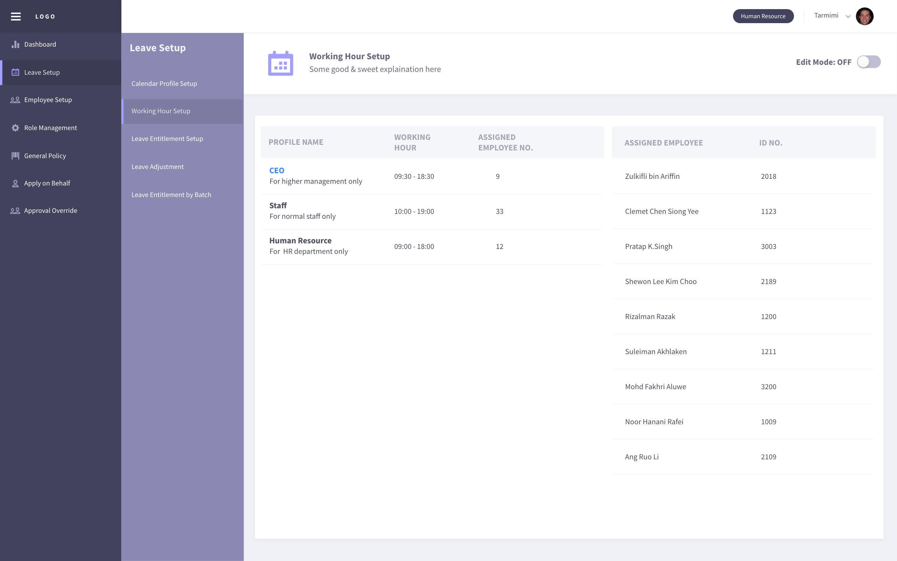
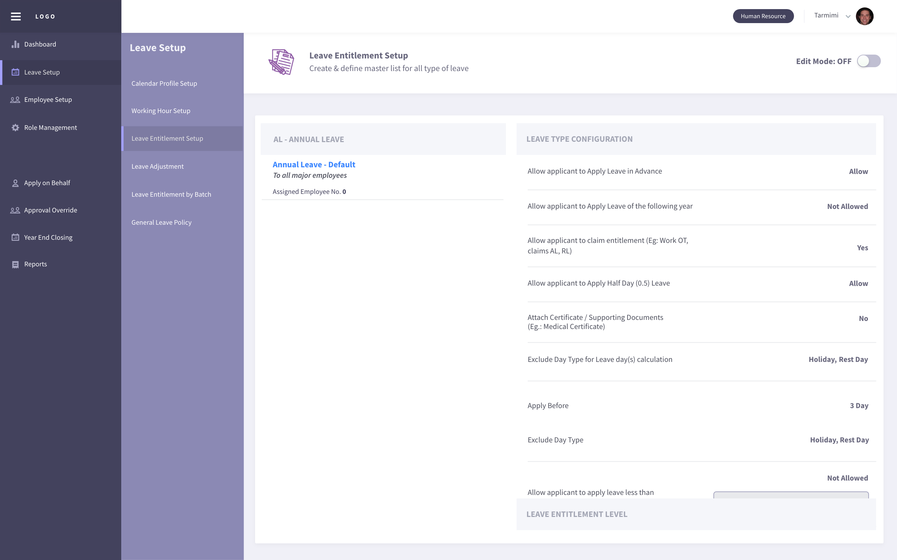
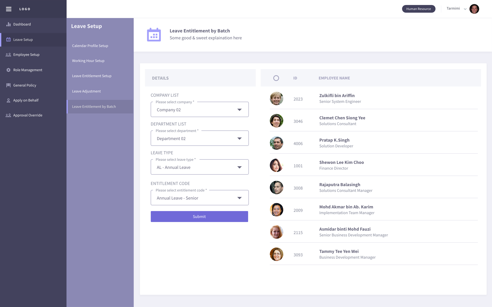
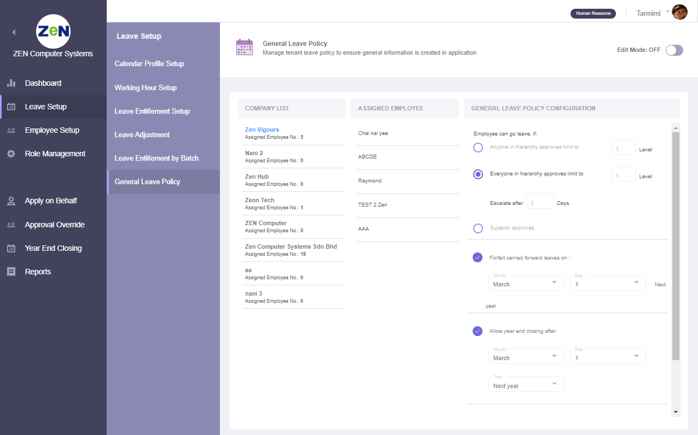
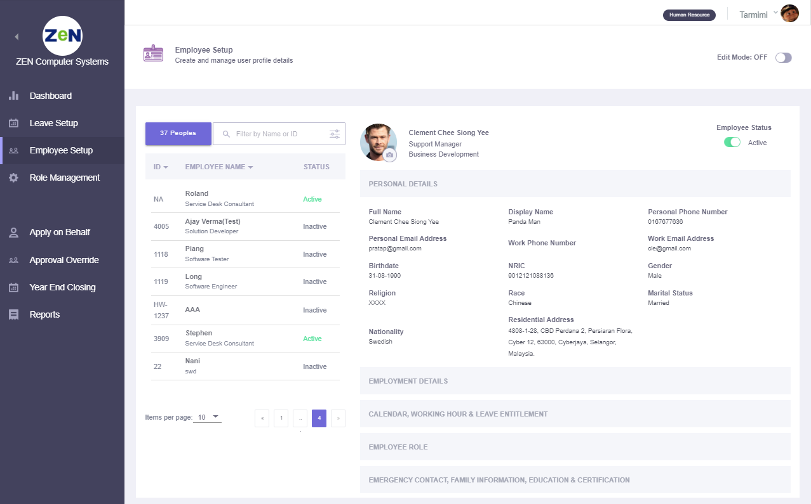
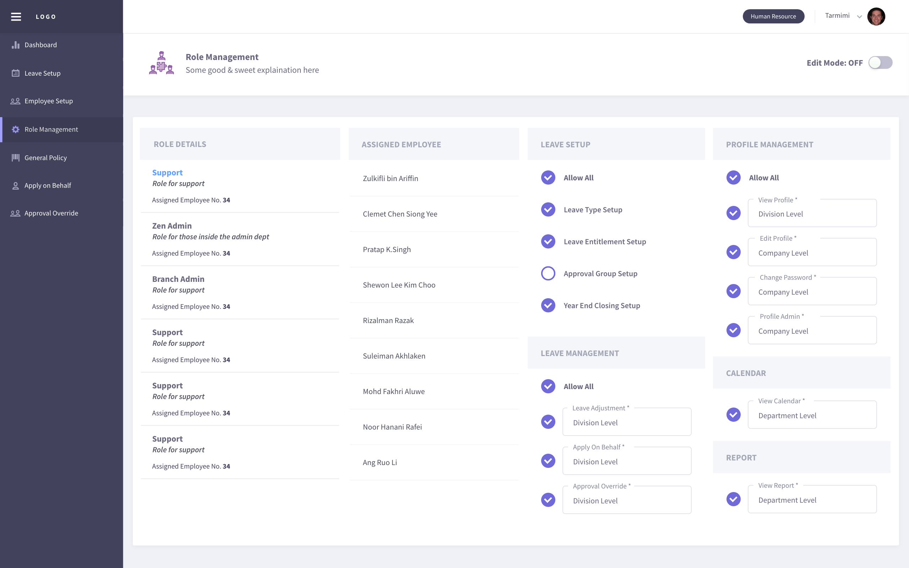
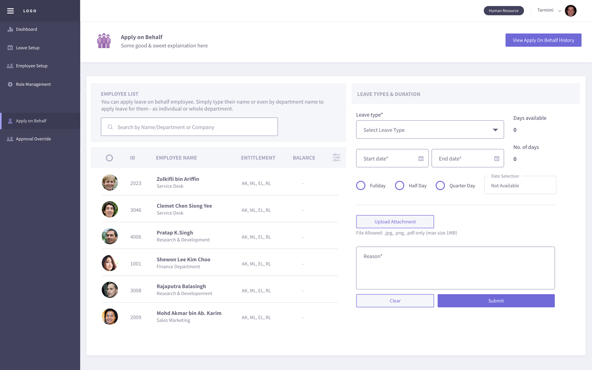
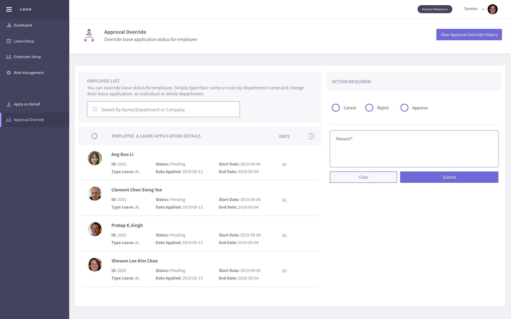
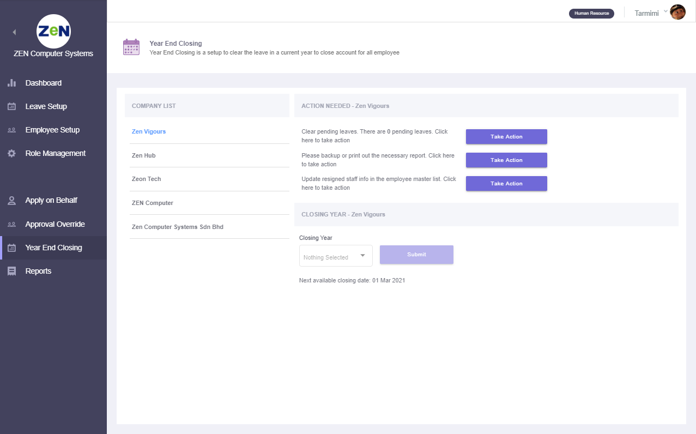
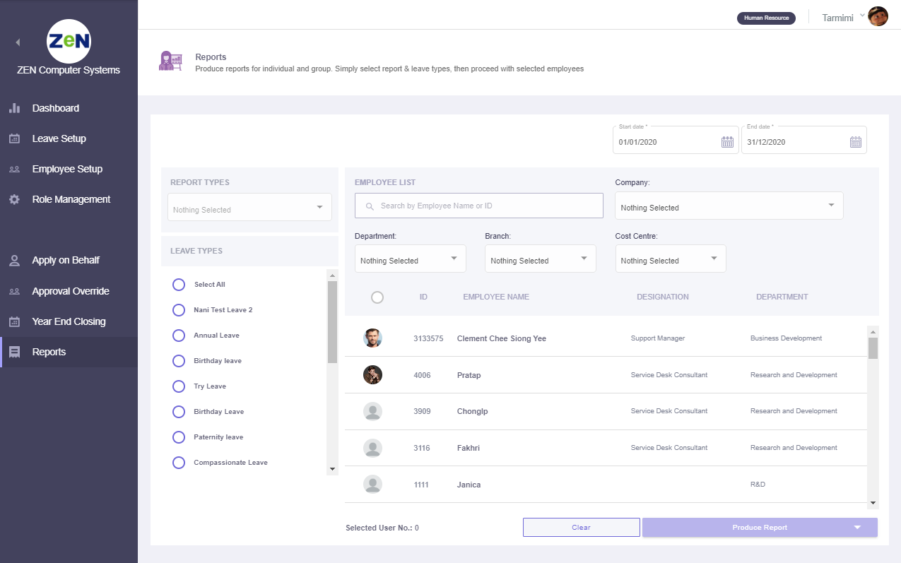

.. eLeave document admin page

===========================================
administration
===========================================

Admin Dashboard
***************
This page will show the details of latest announcement created by administrator and upcoming holiday, birthday, new joiner & leaver. There will be a long leave reminder information too.
Administrator able to manage announcement by create, edit and delete features.

.. image:: images/dashboard.png
      :alt: Dashboard overview

1. Create announcement

Click the Create New button to write new announcement.

.. image:: images/create_announcement.png
      :alt: Create announcement
      :width: 400

2. Edit announcement

Click the edit icon of the selected announcement to do the changes.

.. image:: images/edit_announcement.png
      :alt: Edit announcement
      :width: 400

3. Delete 

Click the delete icon to remove unwanted announcement.

Leave Setup
************

Calendar Profile Setup
======================
Create specific public holiday and rest day for employee.

.. image:: images/calendar_profile.png
      :alt: Calendar profile overview

There have few features as listed here:

1. Create new calendar
2. Edit calendar profile name, rest day & public holiday
3. Delete calendar profile
4. Assign user by using drag & drop individual or bulk
5. Set as new default calendar profile

Working Hour Profile Setup
==========================
Create office working hour for employee

There have few features can be used after toggle Edit Mode to ON as listed here:

1. Create new working hour profile
2. Edit working hour profile name, working hour (full day, half day, quarter day)
3. Delete working hour profile
4. Assign user to desired profile by using drag & drop individual or bulk
5. Set as new default working hour profile

Leave Entitlement Setup
=======================
Create & define master list for all type of leave

The default leave type & leave entitlement profile will be created after administrator account signed up.
Leave entitlement setup started after Edit Mode toggle button was turn ON. 

1. Create New Leave Type & New Leave Entitlement Profile
 Click on the Create New button to create new leave type abbreviation & leave type name. Then, click the Create button to proceed for leave entitlement profile creation. 
 Enter profile name & entitlement description and click Add button to complete creation process.

2. Add/Edit/Delete Leave Type & Entitlement Profile
 Click on the pencil icon at the overview page to Edit Data or Clone Existing Data.
 In Edit Data tab, you're able to edit leave type abbreviation & leave type name. Leave entitlement profile name & description can be edited and profile can be added or deleted.
 Click Save button to save all edited data.

3. Leave Type Configuration
 Select the desired entitlement profile and configure the setting in the Leave Type Configuration tab.

4. Leave Entitlement level
 Default level 1 is created automatically. You're able to edit the service year data, entitled day & bring forward value.
 You can create new level for senior and delete unwanted level data. 

 NOTE: 
  At least one leave entitlement level must be saved

5. Toggle Off Edit Mode
 Lastly, toggle off the Edit Mode button at the top-right corner to save all the leave type configuration & leave entitlement level data.

Leave Adjustment
================
A section to edit and adjust the leave entitlement number of days for selected employee

.. image:: images/leave_adjustment.png
      :alt: Leave adjustment overview

In Details tab, select desired company and department to check the employee list in right hand side tab. Continue select the desired leave type to see employee entitlement number of days.
Select plus(+) or minus(-) symbol and key in number of days to adjust. Lastly, enter reason for this adjustment and remember to tick on the employee before click Submit button to complete.

You can check the leave adjustment history by clicking on the button at the top-right corner.

Leave Entitlement By Batch
==========================
A section to assign leave entitlement to selected employees

In Details tab, select desired company and department list to see employee list in right hand side tab. 
Select leave type and entitlement code/profile filtered by selected leave type. Tick the employees to be assigned under this leave entitlement.
Click on Submit button to complete.

General Leave Policy
====================
Manage tenant leave policy to ensure general information is created in application

View assigned employee list and general leave policy configuration by clicking on the company name.
To enable edit mode, toggle the Edit Mode button at the top-right corner to ON. The setup features including:

1. Create New Company
 Click on the add icon at the Company List tab. Fill in the new company name in the slide-in menu and click on Create button to complete creation.

2. Edit Company Name
 Click on the edit icon to modify company name in the slide-in menu. Complete process by clicking on Update button while cancel changes by clicking outside of the slide-in menu.

3. Delete Company Name with Its General Leave Policy Configuration
 Click on the trash icon to delete the unwanted company and its policy. 

 NOTE:
  Please re-assign all the employees under that (to be delete) company before delete.
  To re-assign employee please go to Employee Setup page.

4. Edit General Leave Policy Configuration
 Simply change the general leave policy configuration of the selected company when the Edit Mode is ON. Toggle OFF Edit Mode to save the changes of the configuration.

Employee Setup
**************
Create and manage user profile details

Role Management
***************
Create the user role and the configuration based on their access level

View the roles list and its access level that assigned to the employee. 
There have few features of role management setup when the Edit Mode toggle button is turned ON.

1. Create New Role/Clone Existing Role Data
 Click on the add icon at the Role Details tab. Choose Create New or Clone Existing Data tab to continue. 
 
 - Create New - Fill in the role name and description for the new role. Tick set as default profile will replace original default profile. Then, click Create button to complete creation. 
 - Clone Existing Data - Tick a role profile that you wish to clone then click on Create button to copy this role profile data. Newly clone role will appear in Role Details list with a (copy) behind the original role name.

2. Edit Role
 Click on the edit icon in Role Details list. From slide-in menu, edit the role name or description and click Update button.

3. Delete Role
 Click on the trash icon to delete role from the list.
 
 NOTE:
  Please re-assign all the employees under that (to be delete) role before delete. 
  Refer item no.5 below to check on how to re-assign employee.

4. Set as New Default Profile
 Shaded star icon is the current default profile. 
 You may change it by clicking on other non-shaded star icon and click Yes button in the confirmation pop-up to replace original role.

5. Re-assign Employee to another Role Profile
 Select a role profile with assigned employee. 
 To move only one employee, drag at the nine-dots icon of employee name box and drop into the role profile box you wish to move;
 To move multiple of employees, tick on the employees and click on ellipses(three-dots) icon then select the role profile you wish to move.

6. Edit Leave Setup, Leave Management, Profile Management, Calendar & Report Access Level
 Edit the access level for all field of setup by tick or untick and choose selection level for the ticked checkbox. Toggle OFF Edit Mode to save all the access level changes.

Apply On Behalf
***************
A section for administrator to apply on behalf for any type of leave for employee

View employee list and their entitlement at the left-side column. 
Filter employee name/department or company from the searchbar to find employee. 
Tick one or multiple employee to configure leave types & duration at the right-side column. 
The configuration for leave types & duration column consists of:

- Select leave type and number of days available is displayed (is hidden when more than one employee is selected)
- Choose the start date and end date. Then, configure day selection (Full Day, Half Day, Quarter Day) of each date
- Upload attachment (eg: medical leave certificate) is optional
- Enter the reason for apply on behalf 
- Click on the Submit button to complete the application

Check the history application by clicking on the View Apply On Behalf History button at the top-right corner.

Approval Override
*****************
Override leave application status for employee

View the employee leave application details at the left-side column. Filter the employee name/department or company to get employee you wish to find. 

- Tick Cancel/Reject/Approve checkbox for the approval action
- Enter reason for the approval
- Click on the Submit button to complete approval

Year End Closing
****************
Year End Closing is a setup to clear the leave in a current year to close account for all employee

View company list and check its action needed before closing. The action needed are:

- Clear the pending leave
- Backup or print the necessary report for documentation
- Update or manage resigned employee

Click on the required Take Action button to route to the Approval Override page, Reports page or Employee Setup page.

Lastly, default closing year is selected automatically.
Click on the Submit button to complete year end closing process.

NOTE:
 If no default closing year is selected, administrator need to wait until the next available closing date as shown below the closing year selection is reached.

Reports
*******
Produce reports for individual and group. Simply select report & leave types, then proceed with selected employees

