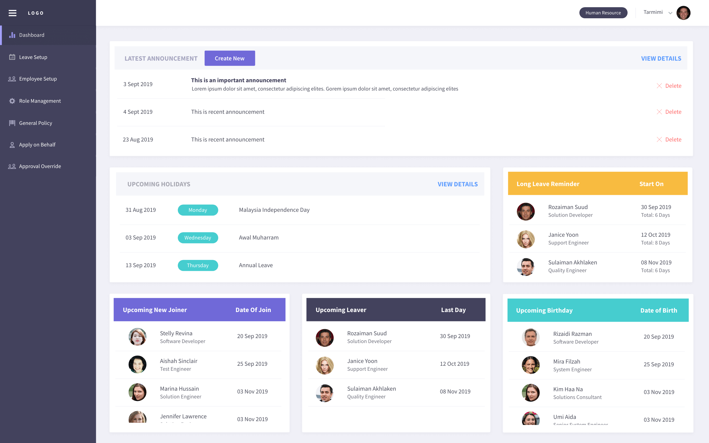
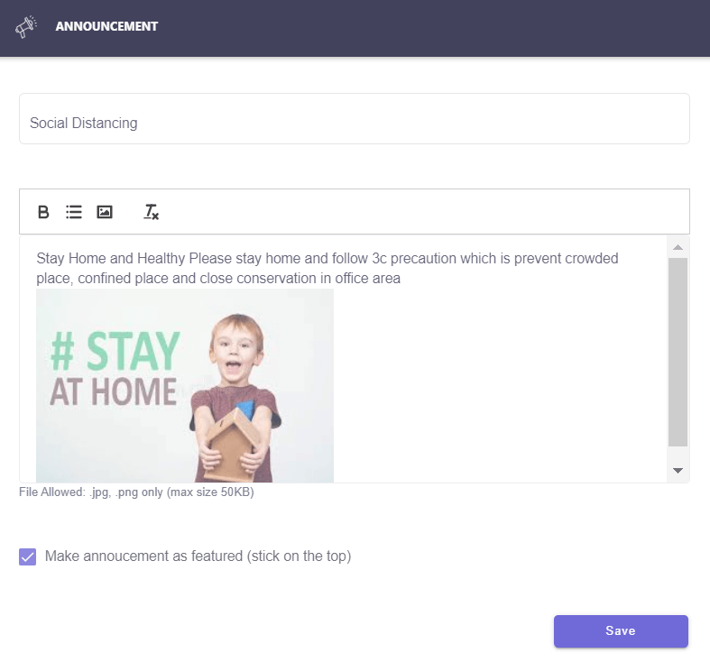

.. eLeave document admin page

===========================================
administration
===========================================

admin dashboard
***************
This page will show the details of latest announcement created by admin and upcoming holiday, birthday, new joiner & leaver. There will be a long leave reminder information too.
Admin able to manage announcement by create, edit and delete features.

1. Create announcement

Click the Create New button to write new announcement.

.. image:: images/create_announcement.png
      :alt: Create announcement
      :width: 400

2. Edit announcement

Click the edit icon of the selected announcement to do the changes.

3. Delete 

Click the delete icon to remove unwanted announcement.

leave setup
************

calendar profile setup
======================
Create specific public holiday and rest day for employee.

.. image:: images/calendar_profile.png
      :alt: Calendar profile overview

There have fews feature as listed here:

1. Create new calendar
2. Edit calendar profile name, rest day & public holiday
3. Delete calendar profile
4. Assign user by using drag & drop individual or bulk
5. Set as new default calendar profile

working hour profile setup
==========================
Create office working hour for employee

leave entitlement setup
=======================
Create & define master list for all type of leave

leave adjustment
================
A section to edit and change the leave for selected employee

leave entitlement by batch
==========================
A section to assign leave entitlement to selected employees

general leave policy
====================
Manage tenant leave policy to ensure general information is created in application

employee setup
**************
Create and manage user profile details

role management
***************
Create the user role and the configuration based on their access level

apply on behalf
***************
A section for administrator to apply on behalf for any type of leave for employee

approval override
*****************
Override leave application status for employee

year end closing
****************
Year End Closing is a setup to clear the leave in a current year to close account for all employee

reports
*******
Produce reports for individual and group. Simply select report & leave types, then proceed with selected employees
