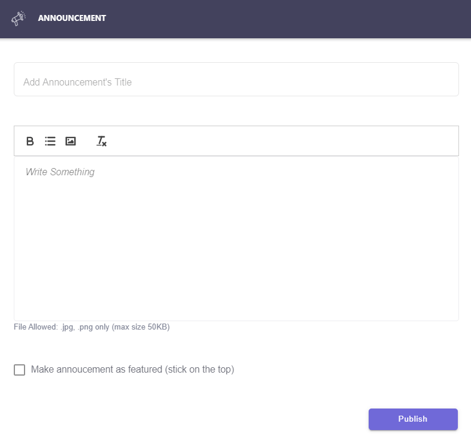
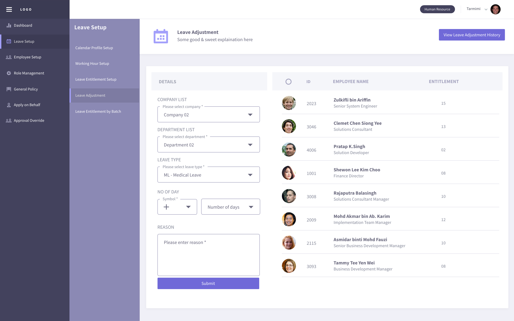

.. eLeave document admin page

===========================================
administration
===========================================

admin dashboard
***************
This page will show the details of latest announcement created by admin and upcoming holiday, birthday, new joiner & leaver. There will be a long leave reminder information too.
Admin able to manage announcement by create, edit and delete features.

.. image:: images/dashboard.png
      :alt: Dashboard overview

1. Create announcement

Click the Create New button to write new announcement.

2. Edit announcement

Click the edit icon of the selected announcement to do the changes.

.. image:: images/edit_announcement.png
      :alt: Edit announcement
      :width: 400

3. Delete 

Click the delete icon to remove unwanted announcement.

leave setup
************

calendar profile setup
======================
Create specific public holiday and rest day for employee.

.. image:: images/calendar_profile.png
      :alt: Calendar profile overview

There have fews feature as listed here:

1. Create new calendar
2. Edit calendar profile name, rest day & public holiday
3. Delete calendar profile
4. Assign user by using drag & drop individual or bulk
5. Set as new default calendar profile

working hour profile setup
==========================
Create office working hour for employee

.. image:: images/working_profile.png
      :alt: Working hour profile overview

There have fews feature can be used after toggle Edit Mode to ON as listed here:

1. Create new working hour profile
2. Edit working hour profile name, working hour (full day, half day, quarter day)
3. Delete working hour profile
4. Assign user to desired profile by using drag & drop individual or bulk
5. Set as new default working hour profile

leave entitlement setup
=======================
Create & define master list for all type of leave

.. image:: images/leave_entitlement.png
      :alt: Leave entitlement overview

leave adjustment
================
A section to edit and change the leave for selected employee

leave entitlement by batch
==========================
A section to assign leave entitlement to selected employees

.. image:: images/leave_entitlement_by_batch.png
      :alt: Leave entitlement by batch overview

general leave policy
====================
Manage tenant leave policy to ensure general information is created in application

.. image:: images/leave_policy.PNG
      :alt: General leave policy overview

employee setup
**************
Create and manage user profile details

.. image:: images/employee_setup.PNG
      :alt: Employee setup overview

role management
***************
Create the user role and the configuration based on their access level

.. image:: images/role_management.png
      :alt: Role management overview

apply on behalf
***************
A section for administrator to apply on behalf for any type of leave for employee

.. image:: images/apply_on_behalf.png
      :alt: Apply on behalf overview

approval override
*****************
Override leave application status for employee

year end closing
****************
Year End Closing is a setup to clear the leave in a current year to close account for all employee

.. image:: images/year_end_closing.PNG
      :alt: Year end closing overview

reports
*******
Produce reports for individual and group. Simply select report & leave types, then proceed with selected employees

.. image:: images/report.PNG
      :alt: Report overview
