.. beesuite document beewhere page

********
BeeWhere
********

Clock in & Clock out flow
*************************

How to clock in and clock out
=============================

1. Ensure you are in main page. 
2. Configure your job task before clock-in.

* Select job type (Office / Site / Home / Others) - Mandatory 
* Select client
* Select project
* Select contract
* Fill up your to do list - This is not a required item, but you would need this to track your activities later.

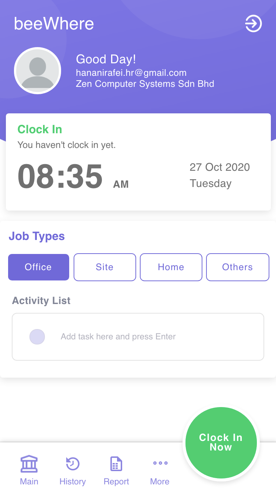

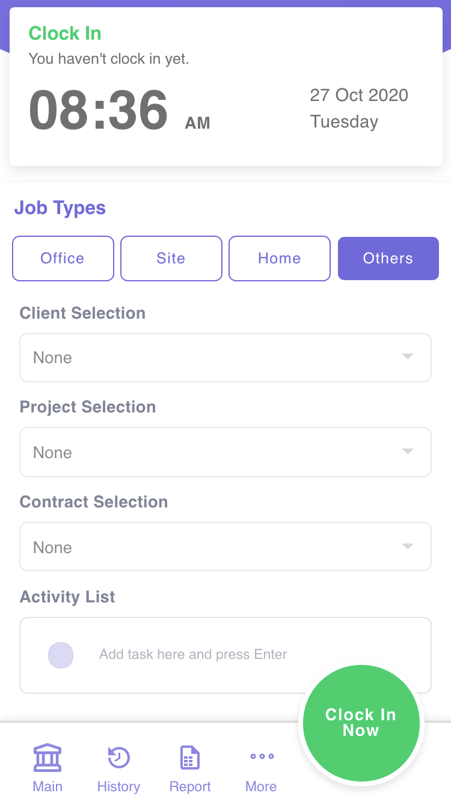

.. note::  Don't worry if you don't see any one of the items above, it just means your profile is not configured to use those.

3. Click "Clock In Now" button of your phone to clock in.

* You can edit/add/delete your activity list before clockout

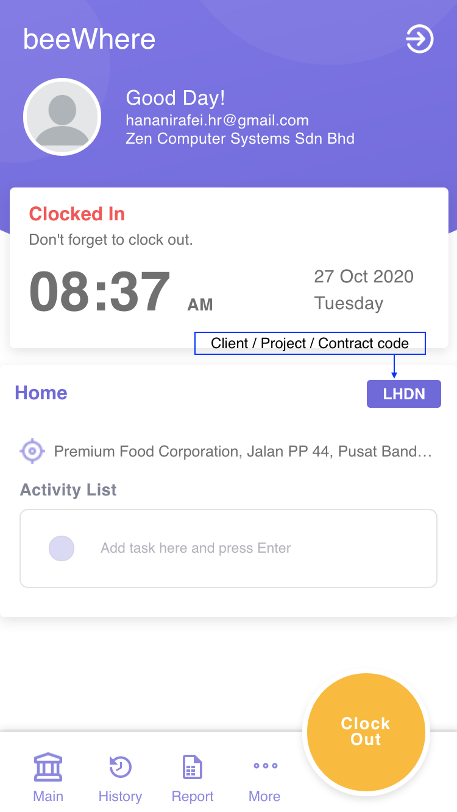

4. Click "Clock out" to clockout. Remember to update your activity list before clock out if required.

Check my historical clock in
==============================

1. Ensure you are in History page.

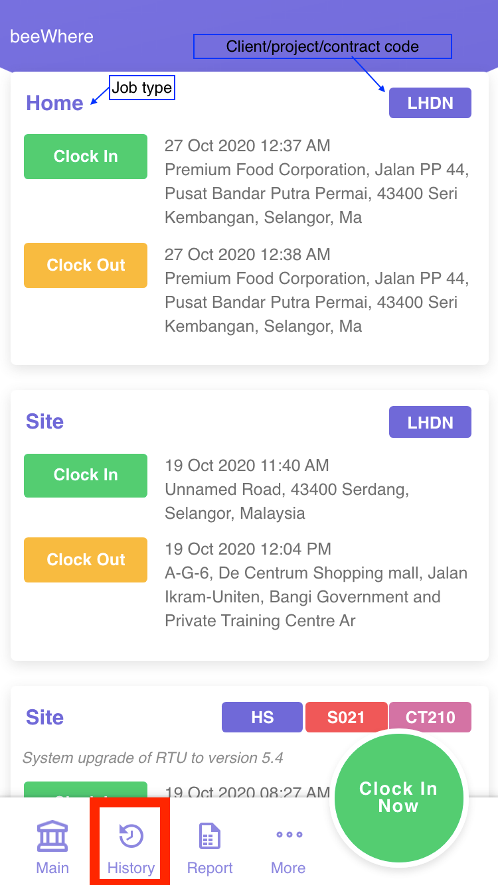

2. If you want to add/edit/delete activity on shown clock in history, tap on target clock in card then it will lead you to the page below.

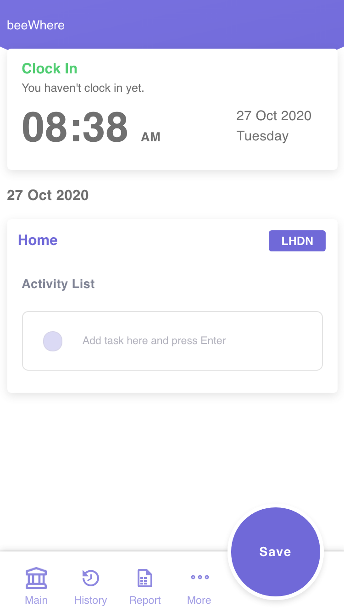

Generate reports
=============================

There is 2 types of report which is attendance report and activities report. To generate the report:
1. Ensure you are in report page
2. Choose your report type either attendance or activities
3. Choose your duration either weekly, monthly, yearly or custom date. 
4. Click "Show" to generate the report

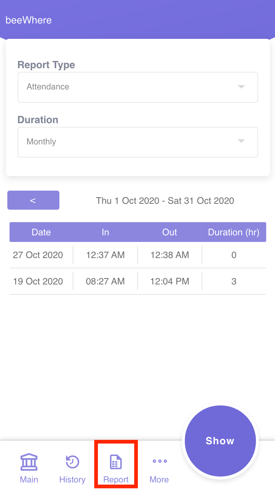

Forget to clock in or forget to clock out
========================================

A request to patch your clockin/clockout time if you forgot or unable to clock.

1. Ensure you are in Support page (More > Support)

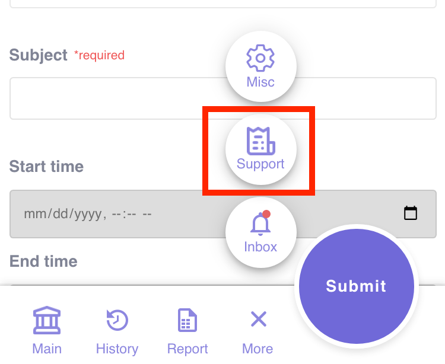

2. Choose "Request" tab
3. Choose Request Type as "Clock In/Clock Out Request"
4. Fill up the form accordingly and click "Submit" to sumbit request

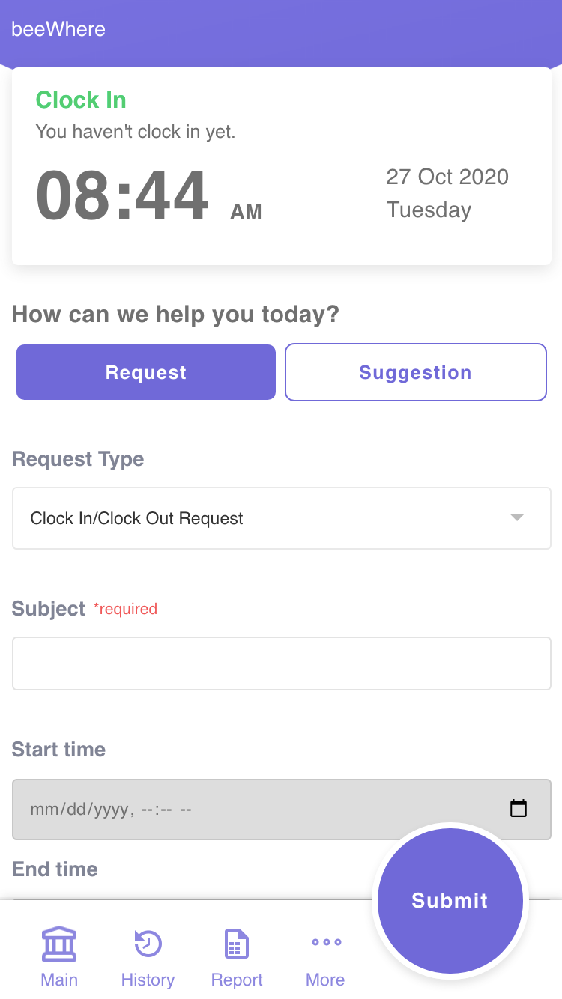

Overtime request
****************

1. Ensure you are in Support page (More > Support)

2. Choose "Request" tab
3. Choose Request Type as "Overtime"
4. Fill up the form accordingly and click "Submit" to sumbit request

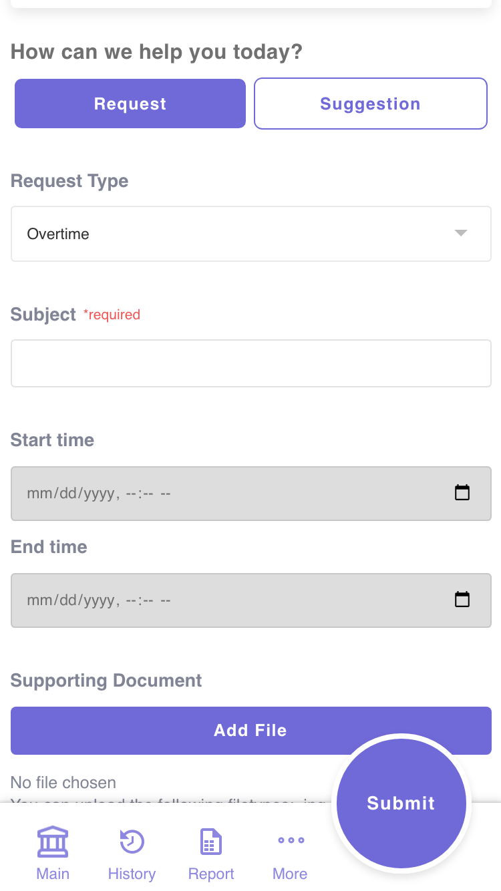

Send feedback
*************

Give feedback or report any bugs
================================

1. Ensure you are in Support page (More > Support)

2. Choose "Suggestion" tab
3. Fill up the form accordingly and click "Submit" to submit request

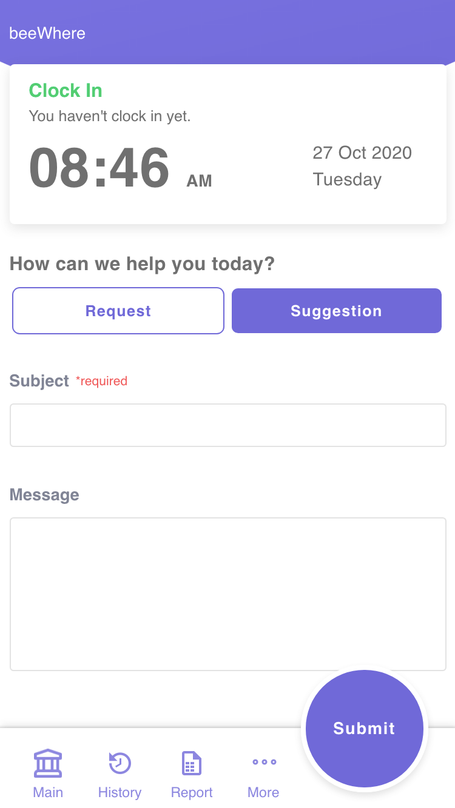

Others
******

Checking activity history
=======================

Ensure you are in Misc page (More > Misc) then click on "Login Activity"a

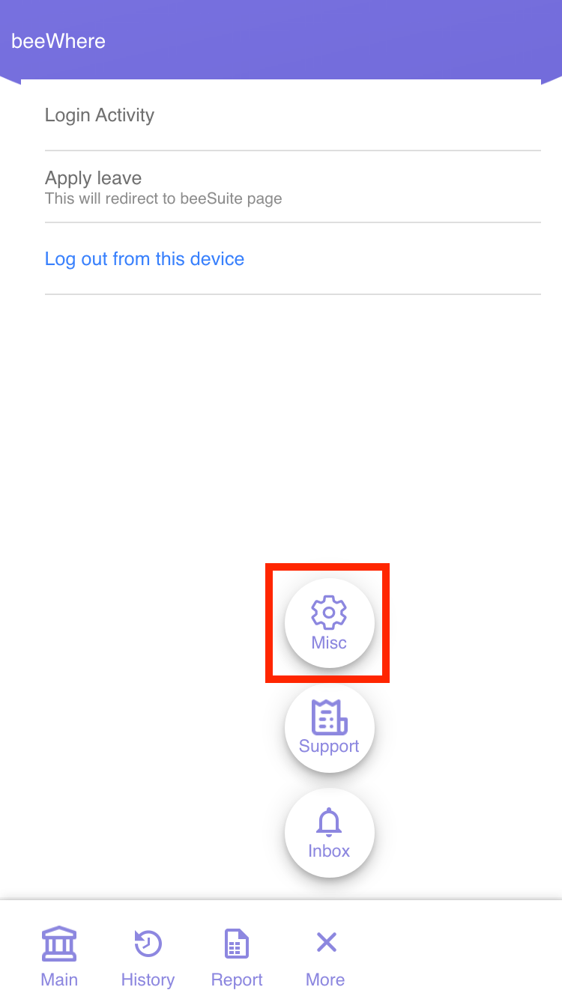

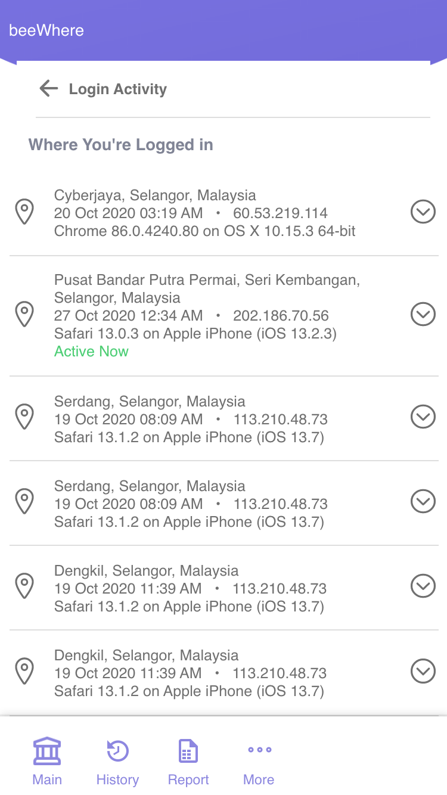
