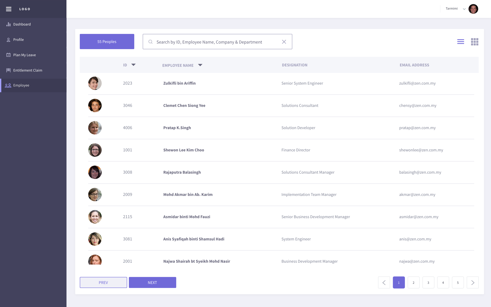
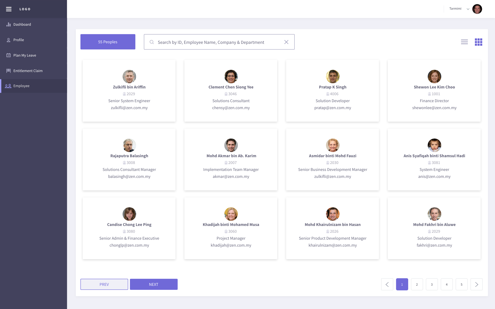

.. beesuite document employee page

*********
Employee
*********

User Dashboard
**************
Dashboard page show the latest announcement posted by admin. 
Check the user's annual, replacement, medical leave balance and upcoming holidays information here. 
User can see their own long leave reminder for more than or equal to 5 days. 
View and request cancel for user leave application. Simply click on the status (Approved/Pending/Rejected) and fill up the cancel reason in the pop-up to request cancellation.
Cancelled leave application is not allowed to submit cancel request again.

NOTE:
 Only superior have the rights to view and take action on the My Tasks content. This content is hidden from the normal user login.

Profile
*******

Personal Details
================
User is free to edit their personal details which including general information, emergency contacts, family & education qualification details.
Simply toggle the Edit Mode button to ON to enable edit mode.
Birthdate, gender, NRIC, nationality and race is not allowed to edit by user. User need to authorize from admin to edit on behalf.

Employment Details
==================
User is allowed to edit their personal bank account name, account number, income tax number & EPF details only. 
Others general employment details modification must inform administrator to edit on behalf. 
To enable the edit mode, please toggle ON the Edit Mode at the top-right corner.

Leave Entitlement
=================
View all the leave type details entitled by the user which including entitled, pending, taken and balance days. 
User can directly click on 'Apply' button to plan and apply leave in leave application page.
Refer :ref:`Plan My Leave` to learn how to apply leave.

Awards & Certification
======================
View or edit awards & certification or qualification details.
Click on the attachment name to download the uploaded file. Edit certification name, enroll year and graduate year by toggled ON the Edit Mode. 
Click on Attachment button to upload certification (PDF/image). Toggle OFF the Edit Mode to save all the changes.

.. image:: images/award.PNG
      :alt: Awards & certification details

Account Setting
===============
Change user profile picture by clicking on the Upload Photo button to upload image.
Change password feature is only available for local profile (whose password is not provided). 
Click on the Change Password button to fill up your current password and new password in the pop-up. 

Plan My Leave
**************
Consist of two tab which is leave application and calendar view.

- Apply leave

 View user leave entitlement details at the right side column. 
 Select leave type and view number of days available. Select the date range in the start date & end date datepicker.
 Select day option (Full Day, Half day, Quarter Day) for each date.
 Upload related attachment (eg: medical certification) if required. Then, enter a reason and click on Submit button to complete leave application.

 NOTE: 
  Attachment is optional and only allowed PDF or image format.

 .. image:: images/user_plan_leave.png
      :alt: Leave application

- View calendar
 
 Check public holiday and who's on leave details at the calendar view tab.
 Click on the date (show light blue color highlight) to check who is on leave on that date. 
 The who is on leave feature is displayed according user level. Eg: Higher management level on leave details is hidden from normal user calendar.

 .. image:: images/user_calendar.png
      :alt: Leave application

Employee Directory
******************
View employee directory table in list view or card view by switching at the top-right icon.
Filter employee name, ID, company or department to see the employee basic information.

